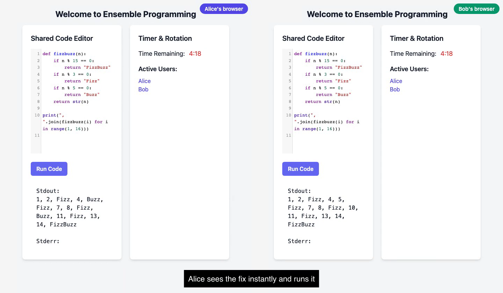

# Ensemble Programming

A shared Python editor for mob/ensemble programming: the whole team works on one codebase in real time, one driver at a time.

[](assets/demo.mp4)

▶️ [Watch the 1-minute demo](assets/demo.mp4)

## Features

- **Live shared editor**: every keystroke streams to everyone in the session, with a "who's typing" indicator.
- **Run code in the browser**: Python runs client-side via [Pyodide](https://pyodide.org) (Python 3.14 on WebAssembly), so the server never executes user code.
- **Rotation timer**: a 5-minute countdown, synced across participants, tells you when to hand over the keyboard.
- **Presence**: see who's in the session.

## How it works

FastAPI serves the pages and WebSocket channels for code, timer and users. Redis holds live session state, and the code is flushed to SQLite (SQLModel) every few seconds. The frontend is Jinja templates with htmx and CodeMirror.

Redis is optional: without it the app falls back to in-memory storage, which is fine for local use.

## Quickstart

```bash
uv sync
cp .env-template .env
docker run -d --name redis -p 6379:6379 redis   # optional
uv run fastapi dev main.py
```

Open `localhost:8000`, create a session, then open the session link in a second browser to join.

## Tests

```bash
uv run pytest -q
```

### Manual test: running code

1. Open `localhost:8000`, create a session, enter a name.
2. Type `x = 1; print("hi", x)` and click **Run Code** → Stdout shows `hi 1`. The first run takes a few seconds while Pyodide (~10 MB) downloads; later runs are instant.
3. Replace the code with `print(x)` and run → Stderr shows `NameError`, because each run starts with a fresh namespace.
4. Run `import sys; print("oops", file=sys.stderr)` → `oops` appears under Stderr.
5. Run `1/0` → Stderr shows a `ZeroDivisionError` traceback and the button is clickable again.
6. Open the session link in a 2nd browser, run code there → output only appears in that browser (execution is local to each participant).

## Re-recording the demo

The demo is scripted with Playwright: two browsers play Alice and Bob, and ffmpeg stitches them side by side with captions.

```bash
uv run uvicorn main:app --port 8765   # in another terminal
uv run --with playwright python assets/record_demo.py
```

Needs ffmpeg and a Playwright Chromium (`uvx playwright install chromium`). Writes `assets/demo.mp4`.
