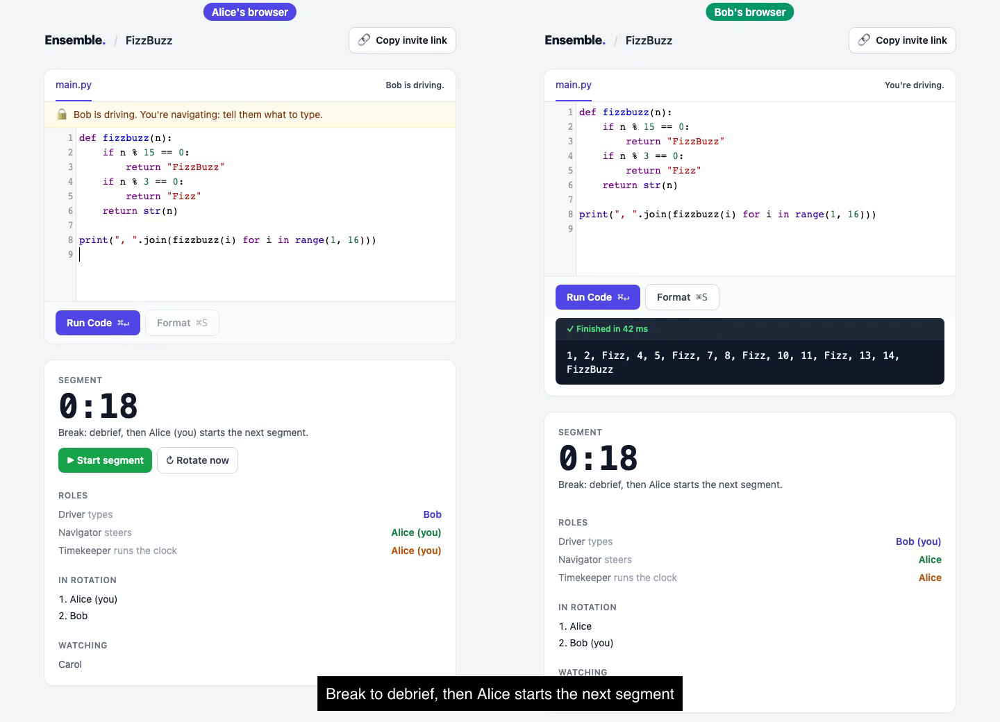

# Ensemble Programming

A shared Python editor for mob/ensemble programming: the whole team works on one codebase in real time, in timed segments with rotating roles.

[](https://ensemble-programming.fly.dev/#demo)

**Try it: [ensemble-programming.fly.dev](https://ensemble-programming.fly.dev)** · ▶️ [Watch the 1-minute demo](https://ensemble-programming.fly.dev/#demo)

## Features

- **Live shared editor**: every keystroke streams to everyone in the session. Only the driver can type.
- **Rotating roles**: driver, navigator and timekeeper rotate each segment, so the navigator drives next. With two people the navigator also keeps time.
- **Timed segments with a debrief**: segments last 5 minutes. When time is up, roles rotate and the team takes a break until the timekeeper starts the next segment.
- **Observers**: uncheck "Take part in the rotation" when joining to sit in and watch without taking a turn.
- **Starter challenges**: pick one of 15 free [Pybites Platform](https://pybitesplatform.com) exercises on the landing page. The session opens with the starter code and a **Run tests** button that runs the exercise's pytest tests in the browser. `make challenges` re-exports them from the platform's catalog (never including solutions).
- **IDE basics, no AI**: Jedi completions (Ctrl-Space, or after a `.`), Ruff warnings as you type and a **Format** button, auto-closing brackets, Cmd/Ctrl-/ to comment, Cmd/Ctrl-Enter to run (add Shift to run a challenge's tests). All of it runs in the browser.
- **Run code in the browser**: Python runs client-side via [Pyodide](https://pyodide.org) (Python 3.14 on WebAssembly), so the server never executes user code.

## How it works

FastAPI serves the pages and two WebSocket channels per session: one for code, one for the rotation (roles, segment timer, who's watching). Redis holds live session state, and the code is flushed to SQLite (SQLModel) every few seconds. The frontend is Jinja templates with htmx and CodeMirror.

Set `ROTATION_SECONDS` in `.env` to change the segment length (default 300).

## Quickstart

```bash
make install                # uv sync + Playwright's Chromium for the browser tests
cp .env-template .env
make redis                  # or: docker run -d --name redis -p 6379:6379 redis
make dev
```

Open `localhost:8000`, create a session, then open the session link in a second browser to join. The timekeeper presses **Start segment** to begin.

## Tests

```bash
make test     # or `make check` to format, lint and test
```

Tests use fakeredis, so they don't need a running Redis.

### Manual test: running code

1. Open `localhost:8000`, create a session, enter a name.
2. Type `x = 1; print("hi", x)` and click **Run Code** → the output panel shows `✓ Finished` and `hi 1`. The first run takes a few seconds while Pyodide (~10 MB) downloads; later runs are instant.
3. Replace the code with `print(x)` and run → `✗ NameError`, because each run starts with a fresh namespace.
4. Run `import sys; print("oops", file=sys.stderr)` → `oops` appears in the stderr section.
5. Run `1/0` → a highlighted traceback pointing at `1/0`, without Pyodide's internal frames, and the button is clickable again.
6. Open the session link in a 2nd browser, run code there → output only appears in that browser (execution is local to each participant).

## Re-recording the demo

The demo is scripted with Playwright: two browsers play Alice and Bob (a third, unrecorded one joins as observer Carol), and ffmpeg stitches them side by side with captions. It uses 18-second segments so the rotation fits in the video.

```bash
ROTATION_SECONDS=18 uv run uvicorn main:app --port 8765   # in another terminal
uv run --with playwright python assets/record_demo.py
```

Needs ffmpeg and a Playwright Chromium (`uvx playwright install chromium`). Writes `static/demo.mp4`.

## Deploy

Runs on [Fly.io](https://fly.io) as one small machine that stops when idle, with SQLite and Redis on a volume (see `fly.toml`). It must stay a single machine: segment timers and connections live in the process.

```bash
make deploy   # fly deploy --ha=false; uses FLY_API_TOKEN if set
make logs
```
